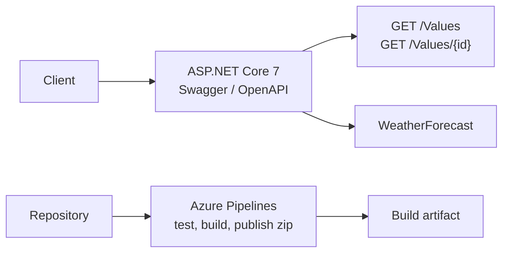

# SimpleAPI

A small ASP.NET Core 7 Web API used as a specimen: OpenAPI on the service, xUnit beside it, and Azure Pipelines producing a published artifact. The controller surface is intentionally tiny. The point is the shape of a service a team can build, test, and ship.

Daniel Brody · [Fractional CTO profile](https://github.com/dzbrody) · [ctorescues.com](https://ctorescues.com/) · Companion reading: [Mastering API Management with Swagger](https://github.com/dzbrody/BrodyBooks)

## Problem

Executive conversations about APIs stall when the room has never seen a service, a contract, and a pipeline in the same repository. Strategy decks describe governance. This repository is the smallest thing that still has all three.

## Solution

| Piece | Where it lives |
| --- | --- |
| Web host | `src/SimpleAPI` — `net7.0`, nullable reference types, implicit usings |
| OpenAPI | Swashbuckle.AspNetCore 6.4.0 and `Microsoft.AspNetCore.OpenApi` 7.0.5 |
| HTTP surface | `WeatherForecastController` (framework template) and `ValuesController` |
| Tests | `test/SimpleAPI.Tests` — xUnit 2.4.1 |
| Pipeline | `azure-pipelines.yml` — test, build, publish a zip artifact on `ubuntu-latest` |

`ValuesController` follows the familiar Les Jackson sample shape. `GET /Values` returns two strings. `GET /Values/{id}` returns a fixed name when `id` is 1. Treat that controller as a placeholder route, and treat the pipeline and the OpenAPI registration as the part worth copying.



## Getting started

Requires the .NET 7 SDK.

```bash
dotnet test SimpleAPI.sln --configuration Release
dotnet run --project src/SimpleAPI/SimpleAPI.csproj
```

The Swashbuckle UI is served from the app when the Development environment is enabled. Confirm the exact path in `Program.cs` after clone. The pipeline definition is `azure-pipelines.yml`: it runs the test project, builds Release, and publishes `src/SimpleAPI/SimpleAPI.csproj` as a zip artifact. It does not deploy to Azure App Service.

## Use cases for a CTO engagement

- **Commercialization.** Show a board the minimum bar before a team calls an API "done": a contract, a test project, and a pipeline that emits an artifact.
- **Due diligence.** Compare a target company's API repository with this shape. Missing tests or a pipeline that only builds on a laptop is a finding.
- **Engineering leadership.** Give a new squad a reference layout before they invent a second one.

For the governance layer around a real API estate — products, versions, policies, Azure API Management — read [BrodyBooks](https://github.com/dzbrody/BrodyBooks).

## Tech stack

- C# / ASP.NET Core 7
- Swashbuckle (OpenAPI)
- xUnit
- Azure Pipelines on Ubuntu

.NET 7 is out of support. A production copy of this skeleton should retarget a current LTS before it is used for anything other than demonstration.

## License and contributions

No license file is in the repository today. Recommended license: MIT, in Daniel Brody's name. Add `LICENSE` before encouraging forks.

Pull requests that add a real domain, authentication, or a deployment stage should say which engagement pattern they illustrate. Cosmetic rewrites of `ValuesController` are low value.

## Work with me

API strategy, Azure API Management, and the diligence question "is this contract actually governed?" are a core part of my fractional CTO work.

[Book a Fractional CTO call](https://ctorescues.com/contact/) · [LinkedIn](https://www.linkedin.com/in/danielbrody/) · [GitHub profile](https://github.com/dzbrody)


---
**CITO for Hire** — design-it · sell-it · build-it · implement-it
[ctorescues.com](https://ctorescues.com) · [Facebook](https://www.facebook.com/people/CTORescues/100067231596849/) · [GitHub](https://github.com/dzbrody) · [LinkedIn](https://www.linkedin.com/in/danielbrody/)
